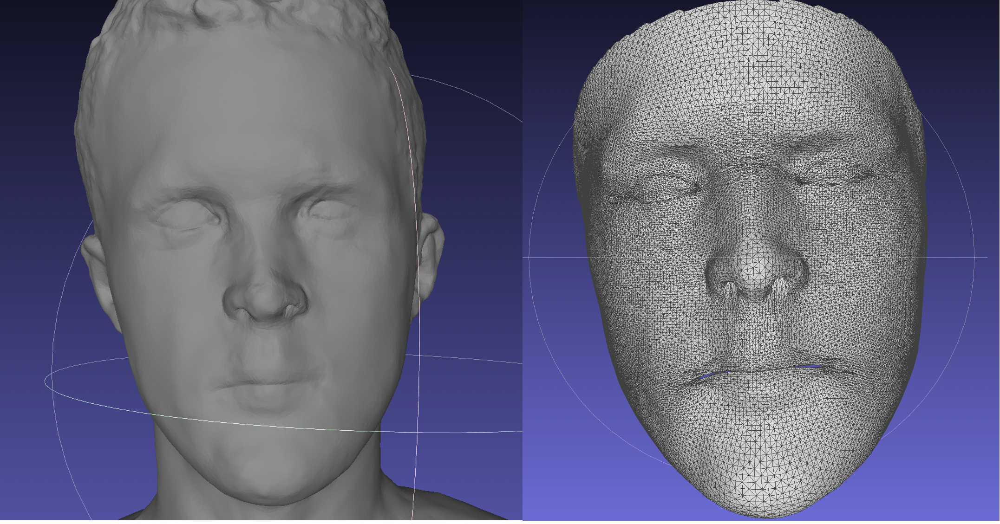
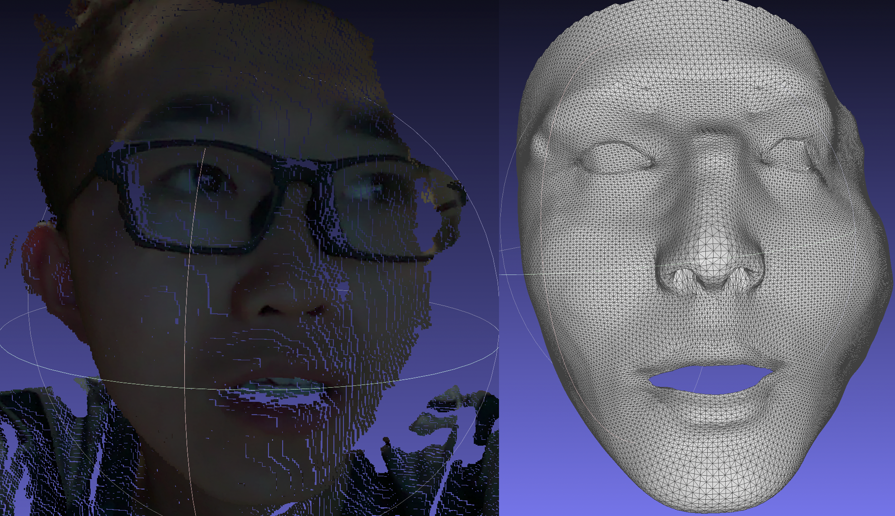
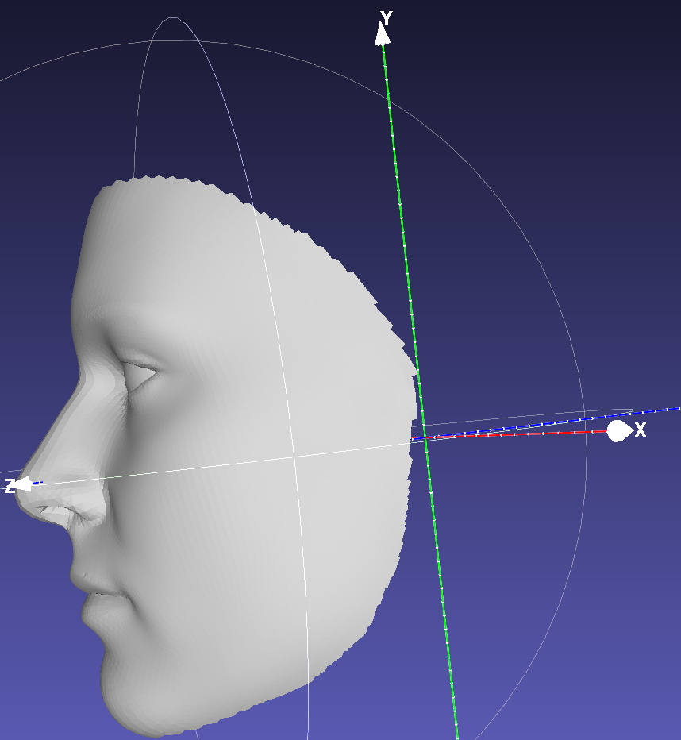

## GPU Accelerated Non-rigid ICP for surface registration

### Introduction
Preivous Non-rigid ICP algorithm is usually implemented on CPU, and needs to solve sparse least square problem, which is time consuming. 
In this repo, we implement a pytorch version NICP algorithm based on paper [Amberg et al](https://gravis.dmi.unibas.ch/publications/2007/CVPR07_Amberg.pdf).
Detailedly, we leverage the [AMSGrad](https://arxiv.org/abs/1904.09237) to optimize the linear regresssion, and then find nearest points iteratively.
Additionally, we smooth the calculated mesh with laplacian smoothness term. With laplacian smoothness term, the wireframe is also more neat.
Also, we support batchwise registration, in each batch, we can registering different meshes with the same template.

------

### Quick Start
#### Install
We use python3.8 and cuda10.2 for implementation. The code is tested on Ubuntu 20.04.
- The pytorch3d **cannot** be installed directly from ```pip install pytorch3d```, for the installation of pytorch3d, please follow the instructions from [pytorch3d](https://github.com/facebookresearch/pytorch3d/blob/main/INSTALL.md).
- For other packages, run
```
pip install -r requirements.txt
```
#### Demo
- For the template face model, currently we use a processed version of BFM face model from [3DMMfitting-pytorch](https://github.com/ascust/3DMM-Fitting-Pytorch). Please download the BFM09_model_info.mat from [3DMMfitting-pytorch](https://github.com/ascust/3DMM-Fitting-Pytorch) and put it into the ./BFM folder.
- For demo, run 
```
python demo_nicp.py
```
Then the NICP from mesh2mesh and NICP from mesh2pointcloud will be conducted. We have two configuration files `./config/fine_grain.json`  and `./config/coarse_grain.json`, which is used respectively for `mesh2mesh` and `mesh2pointcloud` registration. The `./config/fine_grain.json` has less stiffness constraints, which is suitable for registration on accurate scan. The `./config/coarse_grain.json` has less stiffness constraints, which is suitable for registration on noisy pointclouds. 

- We also provide a demo on 4D depth data, we provide a demo in `demo_4D.py`, also, we upload the example depth data in `test_data/depth_wuhz.mp4`, this data is collected from realsense L515. On average, each frame takes 2 seconds for processing.

|  |
|:--:| 
| *Mesh2Mesh* |

|  |
|:--:| 
| *Mesh2Pointcloud* |


#### Notes
The target mesh/pointcloud should face towards `z-axis` as shown in the following picture. Meanwhile, the mesh/pointcloud must be normalized with `utils.normalize_mesh` or `utils.normalize_pcl` before fed into the nicp function.

|  |
|:--:| 
| *Direction* |

### Batchwise NICP
Currently we write some batchwise functions, but batchwise NICP is not supported now. We will support batch NICP in further releases.